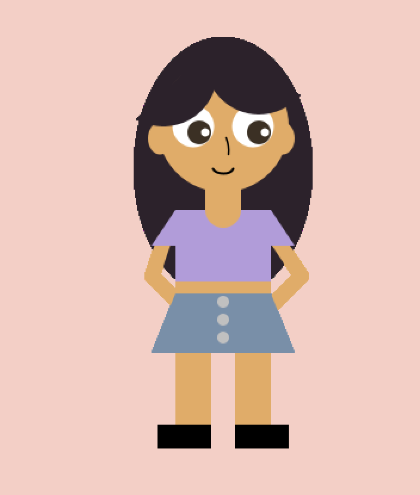

# Assignment 1

## Creating a Self Portrait

For the first assignment, this is the portrait I created:

## 1. Challenge 1: Co-ordinates

I had a difficult time calculating the co-ordinates for each of the elements of my portrait (part of the reason was because the y-axis is actually inverted from what we use in mathematics). So, I ended up using a lot more trial error than I anticipated. However, I also noticed that as time went by, I got more comfortable with this. 

## 2. Challenge 2: Arcs and Radians

It has been a long time since I used radians in mathematics, and so it took me some time to figure out the angles for my arcs(which I used to create curtain bangs).

## 3. Colours

In order to get the exact colors I wanted, I used the following website: https://www.rapidtables.com/web/color/RGB_Color.html. This helped me find the RGB code for specific shades I wanted.

